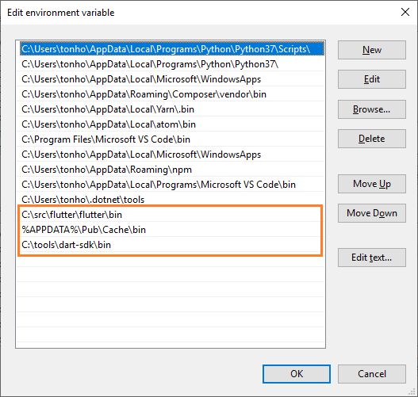

# Flutter-Gallery-Tutorial

[Radial Menu](https://github.com/xqwzts/flutter_radial_menu)

[Login Animation](https://github.com/GeekyAnts/flutter-login-home-animation)

[Awesome Flutter](https://github.com/Solido/awesome-flutter)

[Flutter Example Apps](https://github.com/iampawan/FlutterExampleApps)

--------------------------

## Flutter For Web

> ### Links

[Samples page](https://flutter.github.io/samples/)

[Samples git](https://github.com/flutter/samples/tree/master/web)

[Github repository](https://github.com/flutter/flutter_web)

[Install web build tools](https://github.com/flutter/flutter_web#install-the-flutter_web-build-tools)

> ### Referecense

**Windows Environment Path**

ในภาพด้านล่าง ติดตั้ง dart sdk แยกออกต่างหาก

**Dart sdk with flutter sdk**

ถ้าติดตั้ง flutter sdk ตามขั้นตอนในเว็บ path ก็จะอยู่แบบด้านล่าง แต่ถ้าเก็บไว้ที่อื่นก็ใส่ path ตามนั้น

    C:\src\flutter\bin\cache\dart-sdk\bin

หรือถ้าอยากจะติดตั้ง Dart sdk แยกก็ไปที่หัวข้อ Install dart SDK ล่างสุดเลย

**Reference article**
    
[https://www.didierboelens.com/2019/05/flutter-for-the-web/](https://www.didierboelens.com/2019/05/flutter-for-the-web/)

----

## Install dart SDK

[Official Document](https://dart.dev/get-dart)

